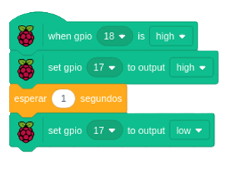

# 🖲️ Proyecto Raspberry

---

En este proyecto utilizamos dos sensores conectados a una Raspberry Pi 4 y lo configuramos para que funcione. El **Zumbador** *(primer sensor)* realiza un sonido al pulsar el **Pulsador** *(segundo sensor)*.

---

---

### 🎞️ [Descargar Video](https://raw.githubusercontent.com/Nando-Asir/proyectoRaspberry/refs/heads/main/videos/pulsadorSonido.mp4)

---

## 👤 [AUTORES](autores.md)
